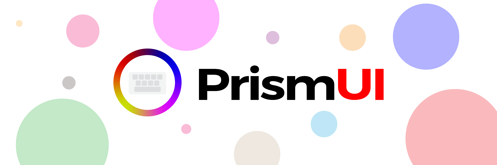

<!-- Banner Image -->

# PrismUI

<!-- Banner Image -->

<!-- Badges -->

 

> Control MSI Laptops x Steelseries RGB peripherals on macOS!

This is a revised version of my previous repo SSKeyboardHue. The driver and the app is now all within one app and uses pure Swift!

## Download

### Latest Stable Version

### Latest Alpha Version

## Usage

Download the stable version and install the app to `~/Applications` folder.

Open PrismUI app and customize your RGB peripherals!

## Compatibility

As of creating this README, only models with Per-Key RGB keyboard work. Soon I will see if I can bring support for three-region keyboards, and with the help of the community support Mystic Light peripherals.

As for Per-Key RGB keyboards, all animations work as intended. If there are any issues please create an issue request.

I am happy to support more MSI or SteelSeries peripherals on macOS!

### Tested On:
- MSI GS65

## Contributing
Pull requests are welcome. For major changes, please open an issue first to discuss what you would like to change.

Please make sure to update tests as appropriate.

## License
[MIT](https://choosealicense.com/licenses/mit/)

## Credits
- [Stevelacy](https://github.com/stevelacy/msi-keyboard-gui) for the inspiration of creating a gui.
- [Askannz](https://github.com/Askannz/msi-perkeyrgb) for `.perKey` keycodes.
- [TauAkiou](https://github.com/TauAkiou/msi-perkeyrgb) for their documentation with the effects implementation.
- [flozz](https://github.com/flozz/rivalcfg) for their color delta calculations.