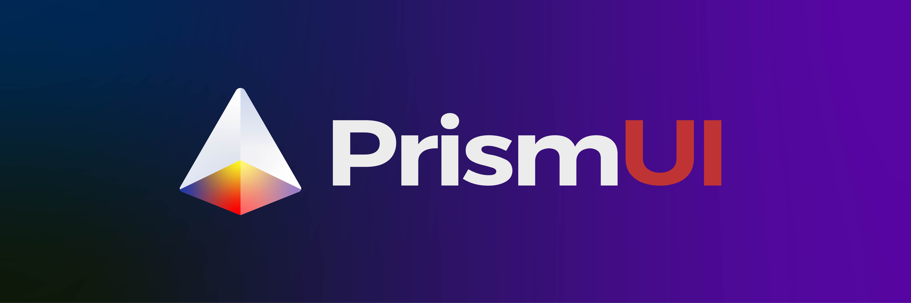

# PrismUI

<!-- Banner Image -->

<!-- Badges -->

> Control MSI Laptops x Steelseries RGB peripherals on macOS!

This is a revised version of my previous repo SSKeyboardHue. The driver and the app is now all within one app and uses pure Swift!

## Installation

Currently it is still a WIP but if you'd like to contribute feel free to fork this repo and submit a pull request.

## Usage

Open PrismUI app and customize your peripheral's RGB!

## Compatibility

As of creating this README, only models with Per-Key RGB keyboard work. Soon I will see if I can bring support for three-region keyboards, and with the help of the community support Mystic Light peripherals.

As for Per-Key RGB keyboards, all animations work as intended. Just need to improve as to when to update keyboard with effects.

## Contributing
Pull requests are welcome. For major changes, please open an issue first to discuss what you would like to change.

Please make sure to update tests as appropriate.

## License
[MIT](https://choosealicense.com/licenses/mit/)
